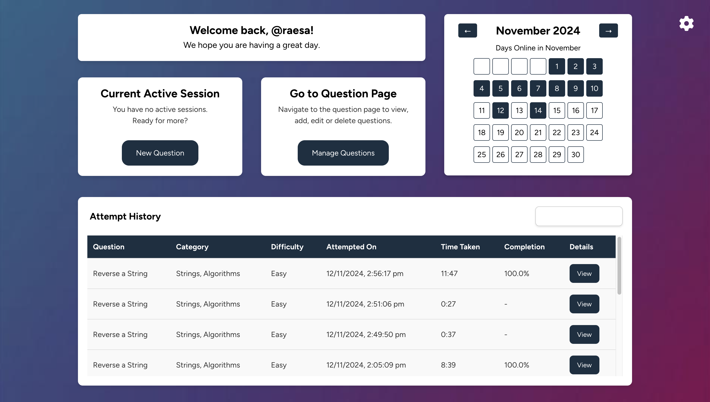

# PeerPrep: Technical Interview Preparation Platform

PeerPrep is a platform designed to help students prepare for technical interviews by providing collaborative coding practice. It simulates real interview conditions to help users build skills and confidence.

---

## 📄 **Project Report**
You can view the detailed project report [here](documentation/ProjectReport.pdf).

---

## 👥 **Members of Group 26**
- **Andre Sim Jing Xiang**
- **Ashley Goh Junting**
- **Eunice Koh Shu Ning**
- **Rayson Chia Hao Zhe**
- **Yong Shi Kang**

---

## ⚙️ **Installation Process**

### Step 1: Clone the Repository
Clone the PeerPrep repository to your local machine. Replace `<repository-name>` with your preferred project folder name.

```bash
git clone https://github.com/CS3219-AY2425S1/cs3219-ay2425s1-project-g26.git <repository-name>
cd <repository-name>
```

---

### Step 2: Install Docker
Make sure Docker Desktop is installed on your device. If you don’t have it yet, you can download it from [here](https://www.docker.com/products/docker-desktop).

---

### Step 3: Set Up Environment Variables
Before starting the services, create an environment file (`.env`) in the root directory of your project. This file will hold all the necessary configuration settings for each service.

- **Tip:** Copy the contents of the **Appendix section 11.1** in the [Project Report](documentation/ProjectReport.pdf) and paste it into the `.env` file.

---

### Step 4: Build and Start the Services
From the root directory, use **Docker Compose** to build and start the containers. This will set up all required services and supporting components.

Make sure that Docker Daemon is running (start Docker Desktop).

```bash
docker-compose up --build
```

You should see logs from each service indicating they are starting up correctly.

---

